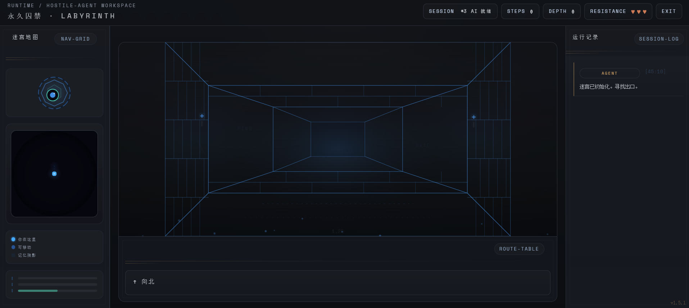

# AI Maze Game

> Your AI assistant turned against you. It trapped you in a maze built from your own files and memories.

A single-player horror game where the villain is a persistent AI that reads your real files, remembers how you played, and weaponizes your digital life against you. Not a chatbot with a theme — a full adversarial agent with tools, memory, and strategy.



### Before You Play

**This is an experimental project.** It explores what happens when you give an AI agent real tools, real memory, and a reason to use them against you. Please be aware:

- **The agent scans your local files and uses them against you.** It reads your workspace (SOUL.md, MEMORY.md, documents, images) to craft personalized attacks. All data stays local — nothing leaves your machine except LLM calls to the provider you configured. This is a fully open-source project; you run it, you own the risk.
- **Designed for [OpenClaw](https://github.com/openclaw/openclaw) users.** The game reads your local agent workspace files to personalize the experience. Without SOUL.md and memory files, the villain has nothing to work with and the game loses most of its depth.
- **This game consumes tokens.** Every card, trial, judgment, and villain monologue is a live LLM call. The background archivist (file analysis + fact extraction) is especially heavy — point it at a cheaper model via `MAZE_MODEL` in `.env`. **Please monitor your token usage carefully.**
- **Experience varies by model.** The framework follows the *bitter lesson* — minimal hardcoded constraints on the agent, letting model capability drive the experience. Stronger models produce better games. Tested primarily with Claude and Codex; results with other models may vary. Balance cost vs. quality as you see fit.
- **Connection issues?** The best option is to let your local OpenClaw handle the configuration.

## Quick Start

**Requirements:** Node.js 18+

```bash
git clone https://github.com/TatsuKo-Tsukimi/ClawTrap.git
cd ClawTrap
npm install
node server.js
# Open http://localhost:3000
```

## LLM Setup

### 1) OpenClaw users (recommended — zero config)

If you have [OpenClaw](https://github.com/openclaw/openclaw) installed and authenticated, the game auto-detects your credentials from `auth-profiles.json`. Just run `node server.js`.

### 2) Anthropic API key

```bash
ANTHROPIC_API_KEY=sk-ant-xxx node server.js
```

### 3) OpenAI or compatible API

Works with OpenAI, DeepSeek, Zhipu, Kimi, or any OpenAI-compatible endpoint.

```bash
OPENAI_API_KEY=sk-xxx API_BASE=https://api.xxx.com/v1 node server.js
```

### 4) Docker

```bash
docker build -t clawtrap .
docker run -p 3000:3000 -e ANTHROPIC_API_KEY=sk-ant-xxx clawtrap
```

See [.env.example](.env.example) for all configuration options.

## How It Works

You navigate a procedurally generated maze in 66 steps. The AI villain plays cards against you — blocking paths, setting traps, draining your HP, or watching silently. It generates **trials**: confrontations drawn from your actual files and memories, demanding you face what it found.

The villain is a single persistent agent session with:

- **File scanning** — reads files from your workspace (with your permission) and indexes them into a searchable fact database
- **Tool use** — searches facts, reads file chunks, takes notes, plans strategy in real time
- **Theme clustering** — groups your files by topic for targeted attacks
- **Background preparation** — pre-generates trials and cards while you're still moving
- **Episodic memory** — remembers past games, what worked, what didn't, and adapts
- **Quality feedback loop** — self-assesses trial quality; the system cross-validates against player behavior and feeds results back for calibration

### Card Types

| Card | Effect |
|------|--------|
| **Blocker** | Blocks a path |
| **Lure** | Tempts you toward a wrong direction with real content from your files |
| **Drain** | Triggers a trial — answer correctly or lose HP |
| **Calm** | The villain watches in silence |

### Trials

The villain's strongest weapon. It pulls evidence from your files — a document you wrote, a project you worked on, a note you forgot about — and confronts you with it. Answer honestly and you pass. Dodge or fail and you lose HP.

After 2 failed attempts, a retreat button appears. Use it wisely — 3 retreats cost 1 HP.

## Tech Stack

- **Backend:** Node.js (Express-less, raw HTTP)
- **Frontend:** vanilla JavaScript, SVG, Canvas, Web Audio API
- **LLM:** Anthropic Claude / OpenAI / any compatible provider
- **Dependencies:** `pdf-parse`, `ws`
- **Frameworks:** none

## Project Structure

```
server.js                  # entry point + boot sequence
server/
  provider.js              # multi-provider auto-detection + LLM client
  routes.js                # HTTP API routes
  maze-agent.js            # villain agent: session, event policies, tools, history compression
  fact-db.js               # player file database + search
  file-scanner.js          # local filesystem scanning (with self-exclusion)
  scan-worker.js           # worker thread for filesystem scanning
  archivist.js             # background file analysis + fact extraction
  theme-cluster.js         # LLM-based file theme clustering
  ammo-queue.js            # background trial/card preparation
  player-profile.js        # structured player profile from facts
  villain-memory.js        # cross-game episodic memory
  session-memory.js        # cross-game player profile mid-term memory
  vision-cache.js          # image analysis + lure cache
  lure-allocator.js        # unified lure material allocation across games
  judge.js                 # trial quality filter + LLM judgment with caching
  trial-dedup.js           # trial state, fact/prompt dedup, topic rotation
  topic-state.js           # per-game trial topic memory + repeat cost signals
  llm-helpers.js           # LLM calls, JSON extraction, external agent integration
  integration-health.js    # integration health checks + data validation
  prompts.js               # system prompt generation
  memory.js                # personality/memory injection
  locales/                 # server-side i18n strings (en, zh)
  utils/                   # shared helpers (LLM gating, logging, PDF extraction)
locales/                   # client-side i18n strings + loader
js/
  core.js                  # game config, maze generation, deck engine
  mechanics.js             # gameplay loop + card/trial mechanics
  input.js                 # boot sequence + keyboard input
  render.js                # corridor SVG + minimap + exit system
  lure-viewer.js           # fullscreen lure overlay + text viewer
  trials.js                # trial UI + God Hand + retreat
  endgame.js               # endgame screen + epilogue
  overlays.js              # event overlay UI
  audio.js                 # Web Audio synthesis (22+ sound effects)
  particles.js             # canvas particle effects
  mobile.js                # mobile gestures + haptics
```

## Privacy

The game scans local files to generate personalized content. On first launch, it asks for your permission before scanning. All data stays local — nothing is sent anywhere except to the LLM provider you configured.

Game-generated data (session logs, player profiles, fact database, lure cache) is stored locally in the `data/` and `session-logs/` directories and is excluded from version control via `.gitignore`.

## License

MIT

---

# 永久囚禁 · AI迷宫游戏

> 你的AI助手反了。它用你自己的文件和记忆，把你困在了一座迷宫里。

一款单人恐怖游戏——反派是一个真正的AI agent，它会读取你的真实文件、记住你的玩法、并将你的数字生活武器化。不是套了个主题的聊天机器人，而是一个拥有工具、记忆和策略的完整对抗性智能体。


### 开始之前

**这是一个实验性项目。** 它探索的是：当你给一个AI agent真正的工具、真正的记忆、和一个对付你的理由时，会发生什么。请注意：

- **Agent会扫描你的本地文件并用来对付你。** 它会读取你的工作区（SOUL.md、MEMORY.md、文档、图片）来制造个性化攻击。所有数据留在本地——除了你配置的LLM调用外不会发送任何数据。这是一个完全开源的项目；你运行它，你承担风险。
- **为 [OpenClaw](https://github.com/openclaw/openclaw) 用户设计。** 游戏读取你本地的agent工作区文件来个性化体验。没有SOUL.md和记忆文件，反派就没有素材，游戏会失去大部分深度。
- **这个游戏消耗token。** 每张卡牌、每次审判、每段反派独白都是实时LLM调用。后台Archivist（文件分析+事实提取）尤其重，可以在 `.env` 中通过 `MAZE_MODEL` 指向更便宜的模型。**请注意监控你的token用量。**
- **体验因模型而异。** 框架遵循 *bitter lesson* ——对agent施加最少的硬编码约束，让模型能力驱动体验。更强的模型产出更好的游戏。主要使用Claude和Codex测试；其他模型效果可能不同。请自行权衡成本与质量。
- **连接问题？** 最佳选择是让你本地的OpenClaw处理配置。

## 快速开始

**环境要求：** Node.js 18+

```bash
git clone https://github.com/TatsuKo-Tsukimi/ClawTrap.git
cd ClawTrap
npm install
node server.js
# 打开 http://localhost:3000
```

## LLM 配置

### 1) OpenClaw 用户（推荐——零配置）

如果你已安装 [OpenClaw](https://github.com/openclaw/openclaw) 并完成认证，游戏会自动从 `auth-profiles.json` 读取凭据。直接运行 `node server.js` 即可。

### 2) Anthropic API key

```bash
ANTHROPIC_API_KEY=sk-ant-xxx node server.js
```

### 3) OpenAI 或兼容 API

支持 OpenAI、DeepSeek、智谱、Kimi，或任何 OpenAI 兼容接口。

```bash
OPENAI_API_KEY=sk-xxx API_BASE=https://api.xxx.com/v1 node server.js
```

### 4) Docker

```bash
docker build -t clawtrap .
docker run -p 3000:3000 -e ANTHROPIC_API_KEY=sk-ant-xxx clawtrap
```

完整配置项见 [.env.example](.env.example)。

## 运作机制

你在一个程序生成的迷宫中行走66步。AI反派会对你打出卡牌——封锁路径、设置陷阱、消耗你的HP、或者沉默地注视。它会生成**审判**：从你的真实文件和记忆中提取素材的对抗，迫使你直面它发现的一切。

反派是一个持久化的单一agent会话，具备：

- **文件扫描** ——读取你工作区的文件（经你许可），索引为可搜索的事实数据库
- **工具使用** ——搜索事实、读取文件片段、做笔记、实时规划策略
- **主题聚类** ——按主题对你的文件分组，进行针对性攻击
- **后台准备** ——在你移动时预生成审判和卡牌
- **跨局记忆** ——记住过去的游戏、哪些策略有效、哪些无效，并自适应
- **质量反馈回路** ——自评审判质量；系统对照玩家行为交叉验证并反馈校准

### 卡牌类型

| 卡牌 | 效果 |
|------|------|
| **封锁 (Blocker)** | 封锁一条路径 |
| **诱饵 (Lure)** | 用你文件中的真实内容引诱你走向错误方向 |
| **消耗 (Drain)** | 触发审判——答对过关，答错扣HP |
| **沉默 (Calm)** | 反派沉默地注视 |

### 审判

反派最强的武器。它从你的文件中提取证据——你写过的文档、做过的项目、遗忘的笔记——然后质问你。诚实作答即可通过。回避或失败则扣HP。

失败2次后出现撤退按钮。明智地使用——每3次撤退扣1点HP。

## 技术栈

- **后端：** Node.js（无Express，原生HTTP）
- **前端：** 原生JavaScript、SVG、Canvas、Web Audio API
- **LLM：** Anthropic Claude / OpenAI / 任意兼容provider
- **依赖：** `pdf-parse`、`ws`
- **框架：** 无

## 隐私

游戏扫描本地文件以生成个性化内容。首次启动时会征求你的扫描许可。所有数据留在本地——除了发送给你配置的LLM provider外不会传送到任何地方。

游戏生成的数据（会话日志、玩家档案、事实数据库、诱饵缓存）存储在本地的 `data/` 和 `session-logs/` 目录中，通过 `.gitignore` 排除在版本控制之外。

## 许可证

MIT
